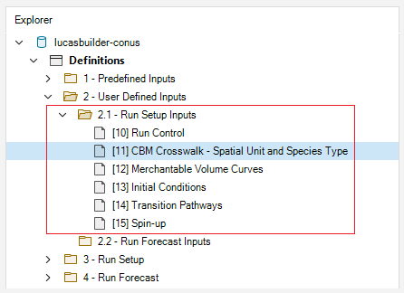
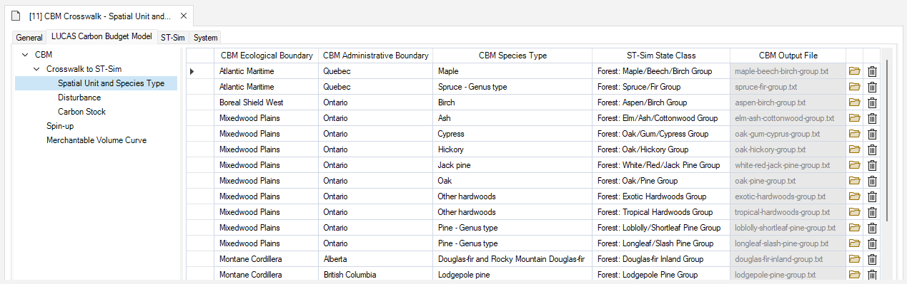
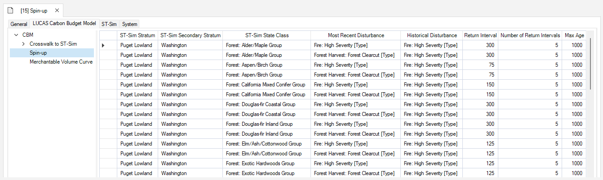
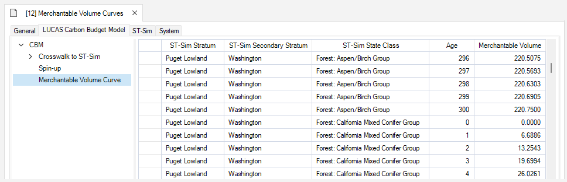
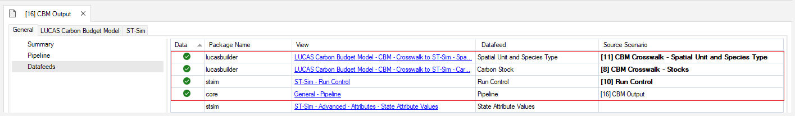
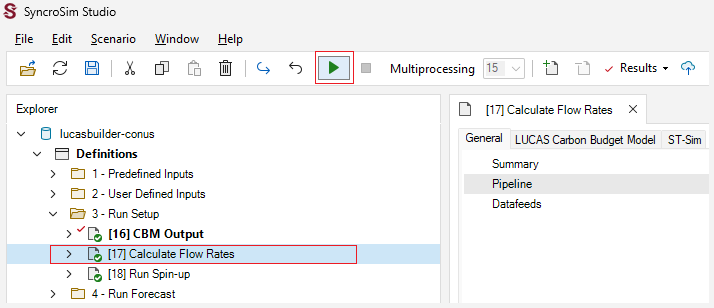

# Getting started with **LUCAS Builder**

## Quickstart Tutorial

This quickstart tutorial will introduce you to the basics of working with **LUCAS Builder**. The steps include:

1. Installing LUCAS Builder
2. Creating a LUCAS Builder Library from a template
3. Viewing model inputs and outputs
4. Running the model

## **Step 1: Install LUCAS Builder**
**LUCAS Builder** is a *package* within the Syncrosim simulation modeling framework, and requires **SyncroSim Studio** to be installed on your computer. Download and install <a href="https://syncrosim.com/download/" target="_blank">**SyncroSim**</a>  3.1.9 or later.

To install the **LUCAS Builder** package, open **SyncroSim** and select **File > Local Packages > Install from Server...**, select the **lucasbuilder** package and click OK. Repeat the process to intall the **stsim** package. Visit the <a href="https://docs.stsim.net/" target="_blank">ST-Sim documentation</a> page for additional information on ST-Sim.

If you do not have **Miniforge** installed on your computer, a dialog box will open asking if you would like to install Miniforge. Click **Yes**. Once Miniforge is installed, a dialog box will open asking if you would like to create a new conda environment. Click **Yes**. Note that the process of installing Miniforge and the **lucasbuilder** conda environment can take several minutes. If you choose not to install the conda environment, you will need to install <a href="https://www.r-project.org/" target="_blank">**R**</a> version 4.1.3 or later.

> **Miniforge** is an installer for conda, a package environment manager that installs any required packages and their dependencies. By default, **lucasbuilder** runs conda to install, create, save, and load the required environment for running **LUCAS Builder**, including the R software and necessary packages.

> **Note:** The **LUCAS Builder** package includes a template library, **LUCAS Builder - CONUS**, that contains example inputs and outputs. Installation of conda or R is not required to view the Template Library inputs and outputs.

## **Step 2: Create a new LUCAS Builder Library**
Having installed the **LUCAS Builder** package, you are now ready to create your first SyncroSim Library. A *Library* is a file (with extension *.ssim*) that contains all of your model inputs and outputs. The format of each library is specific to the Package for which it was initially created. You can opt to create an empty library or download the **lucasbuilder** template library. In this tutorial, we will be using the the **LUCAS Builder - CONUS** template library.
* Go to **File > New > From Online Template...** 
 

 
In this window:
 
* Select the row for **lucasbuilder**. Note that as you select a row, the list of **Templates** available and suggested **File name** for that base package are updated.
* Select the **LUCAS Builder - CONUS** template as shown above.
* Optionally, type in a new **File name** for the library (or accept the default); you can also change the target **Folder** using the **Browse...** button.

> **Note:** If you intend on using Multiprocessing (recommended), ensure your SyncroSim library is saved to a drive that is not being syncronized to the cloud. Saving your library to OneDrive, Dropbox or some other similar location can result in an error when completing a model run.

When you are ready to create the library file, click **OK**. A new library will be created and loaded into the library *Explorer*.

## **Step 3: Review the model inputs and outputs**
The contents of the template library are now displayed in the *Explorer*. Model inputs in SyncroSim are organized into *Scenarios*, where each scenario consists of a suite of values, one for each of the model's required inputs.

Because you chose the **LUCAS Builder - CONUS** template when you created your library, it already contains four folders:
* 1 - Predefined Inputs
* 2 - User Defined Inputs
* 3 - Run Setup
* 4 - Run Forecast

The **Predefined Inputs** folder contains pre-configured scenarios that act as inputs for the **Run Setup** and **Run Forecast** scenarios. The **User Defined Inputs** folder contains two sub-folders (**Run Setup Inputs** and **Run Forecast Inputs**) that house user input scenarios that need to be populated before running the **Run Setup** and **Run Forecast** scenarios.
>**Note:** The **User Defined Inputs** have been populated to provide an executable example to help you get started quickly.

In the  **User Defined Inputs**  folder, select and review the inputs for the scenarios in the **Run Setup Inputs** sub-folder.
 

 

* Select the Scenario named  **CBM Crosswalk – Spatial Unit and Species Type**  in the *Explorer*.
* Double-click to open the scenario and view its details.

This opens the scenario *Properties* window. The first tab in this window, called **General**, contains three *datasheets*. The first, **Summary**, displays some general information for the scenario. The second, **Pipeline**, allows the user to select the run order of the inputs in the model. Finally, the **Datafeeds** datasheet (shown below) displays a list of all data sources.

* Select the **CBM Crosswalk to ST-Sim – Spatial Unit and Species Type** datafeed to view the example inputs.

 

 

>**Note:** Populated datasheets will appear at the top of the Datafeeds list with a green check mark in the *Data* field.

The crosswalk datasheet allows a user to associate each forest type to a CBM equivalent combination of Ecological Boundary, Admin Boundary, and Species Type.  Here a user can specify temperature values that should be used when modeling dead organic matter transfer and decay rates.  Note that if temperature values are not specified, the default values for the selected Ecological Boundary will be used. Optionally, a user can load CBM output files, which can be compared against simulations run in ST-Sim for validation purposes (see below).
 

 
>**Note:** In the example, the **ST-Sim Stratum**, **ST-Sim Secondary Stratum**, and **Average Temperature** columns have been populated and hidden for image clarity. In a custom library, users will need to manually set values for these columns.

Looking at the **Spin-up** scenario, we see that each ST-Sim State Class defined in the species crosswalk has been linked with each transition (disturbance) type.
 

 

Merchantable volume curves need to be added to the **Merchantable Volume Curve** scenario for each ST-Sim State Class defined in the species crosswalk.
 

 

When all scenarios in the **User Defined Inputs** folder are populated, the **Run Setup** scenarios can be run.
 

 

Click on the scenarios in the **Run Setup** and **Run Forecast** folders to view the scenario dependencies and familiarize yourself with each scenario's inputs. 
The **CBM Output** scenario has already been run, so you will also see a *Results* folder within this scenario.

Open the **CBM Output** scenario and select **Pipeline** from the **General** tab. Notice that only the first stage, *1 - Load CBM Output*, has been selected for this scenario. This stage serves to build results based on the standard CBM-CFS approach, and is optional in your analysis. 

Now select **Datafeeds** from the **General** tab to see the scenario's active datasheets. 
 

 
Open the Result Scenario for **CBM Output**. 
 

 
Looking at **Datafeeds**, notice that the **State Attribute Values** datasheet was populated as a result of running the **CBM Output** scenario. 
 

 

Following the steps above, view the **Pipeline** and input and output **Datafeeds** for the **Calculate Flow Rates** and **Run Spin-up** scenarios.

## **Step 4: Run the model**

If not using conda, SyncroSim needs the location of your R executable, which will be found automatically if it is installed in the default location. To check, double-click on **lucasbuilder-conus** and navigate to the **System** tab. In the **Tools > R** datasheet, you should see the file path to your R executable. If not, click **Browse...** and navigate to the correct file location. 

Select the **Calculate Flow Rates** scenario and press **Run** on the top toolbar. If prompted to save your project, click **Yes**. 
 

 
If the run is successful, you will see a *Status* of **Done** in the *Run Monitor* window, at which point you can close the *Run Monitor* window; otherwise, click on the **Run Log** link to see a report of any problems. Make any necessary changes to your scenario, then re-run the scenario.
 

 

Repeat the process with the **Run Spin-up** scenario. Notice that the outputs from the **Calculate Flow Rates** scenario serve as inputs for the spin-up runs. In turn, the results from the **Run Spin-up** scenario are used as inputs for the **Single Cell - No Disturbance** scenario. Looking at the *Pipeline* of each scenario, you can notice the sequence of modeling stages. 

> **Warning Note:** Running these scenarios will take approximatelly 3.5 GB of disk space.

Once the **Run Setup** scenarios have completed successfully, the **Run Forecast** scenarios can be run. 

Repeat the steps above to run the **Single Cell – No Disturbance** scenario.

When a scenario is run, a new Results Scenario will appear in the Results folder, and its results are automatically loaded after a successfull scenario run. **Scenarios** which contain results added to the results viewer appear in **bold** in the *Explorer*. 
 

 

You can add and remove Results Scenarios from the list of scenarios being analyzed by selecting a scenario in the *Explorer* and then choosing either **Add to Results** or **Remove from Results** from the scenario menu. To simplify the outputs, right-click over the **Calculate Flow Rates** and **Run Spin-up** scenarios and select **Remove from Results** at the bottom of the menu.

Scenario results can be viewed and compared through **Charts** and **Maps**. You can compare the results of your **Single Cell – No Disturbance** run with validation outputs generated by the **CBM Output** scenario by adding both scenarios to the *Results Viewer*. 

Move to the **Charts** tab at the bottom left of the **Scenario Manager** screen and double-click on the **Single Cell – Biomass** chart to open it.
 

 
The following charts will be plotted.
 

 

Double-click on the **Single Cell – Aboveground DOM** and **Single Cell – Belowground DOM** charts to view the results. You can view results for the different forest types by changing the **State Class** selection and then clicking **Apply**.  
 

 

> **Note:** This example is non-spatial. Therefore, there are no map outputs to display.

For some forest types, the biomass and Dead Organic Matter (DOM) pools, in the **Single Cell- No Disturbance** scenario differ slightly from the CBM output. The CBM output relies on different default parameter values. For example, modifying the average temperature in the **CBM Crosswalk – Spatial Unit and Species Type** scenario or modifying the return interval and the number of return intervals in the **Spin-up** scenario will affect how much carbon accumulates in the DOM pools. 

Here we use 5 return intervals as the number of disturbance cycles in our Spin-up as an example; however, the number of return intervals should be increased (e.g., >= 10) to ensure the Dead Organic Matter pools have reached equilibrium. For example, Kurz et al. (2009) assumes that equilibrium has been reached only when the sum, of the above- and below- ground slow pools, differs by less than 1% between two consecutive disturbance intervals. To determine whether equilibrium has been reached look at the difference between the last two peaks summed for the above- and below-ground slow pools in the results of the **Run Spin-up** scenario. If values have not reached equilibrium, increase the number of return intervals in the **Spin-up** scenario which can be found in the **2.1 Run Setup Inputs** folder. Then, re-run the **Run Spin-up** scenario in the **3 – Run Setup** folder. To apply these changes to the initial stock values, re-run the **Single-Cell - No Disturbance** scenario in the **4 – Run Forecast** folder. 

Also, minor differences with the CBM output occurred, because we used regionally specific parameters instead of using the default values in the CBM. For example, we used a fire return interval of 1000 years for the Redwoods Forest Type Group.

Lastly, we used a different smoothing algorithm for aboveground biomass pools at low merchantable volumes compared to the CBM-CFS3, which resulted in minor differences with the CBM output for the biomass and DOM pools at young stand ages. We used a different smoothing algorithm because the default CBM-CFS3 smoothing algorithm occasionally causes unrealistic peaks at young stand ages in the biomass pools.”

