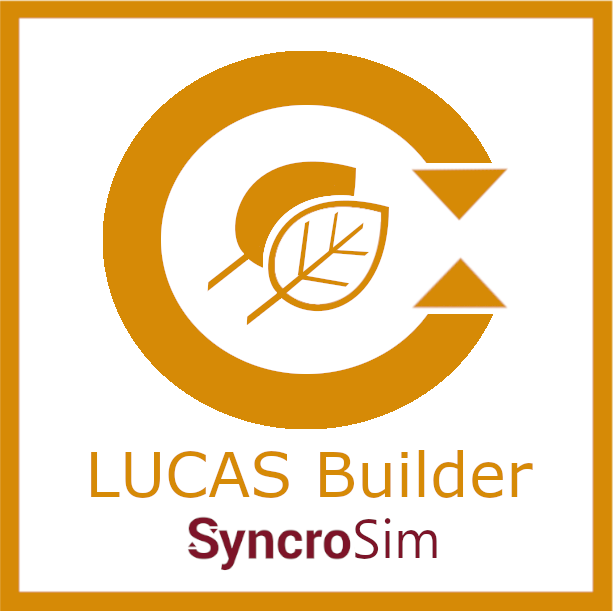

# **LUCAS Builder** SyncroSim Package

    <a href="https://github.com/ApexRMS/lucasbuilder">
 

## Landscape scale forest carbon simulations

### *LUCAS Builder* is an open-source <a href="https://syncrosim.com/download/" target="_blank">SyncroSim</a> package for integrating dynamics from the Carbon Budget Model of the Canadian Forest Sector (CBM-CFS3) into the <a href="http://docs.stsim.net" target="_blank">ST-Sim</a> landscape simulation model.

**LUCAS Builder** integrates inputs and outputs from the Carbon Budget Model of the Canadian Forest Sector (<a href="https://natural-resources.canada.ca/climate-change/climate-change-impacts-forests/carbon-budget-model" target="_blank">CBM-CFS3</a>, <a href="https://doi.org/10.1016/j.ecolmodel.2008.10.018" target="_blank">Kurz *et al*. 2009</a>) into landscape scale simulations using the <a href="http://docs.stsim.net" target="_blank">ST-Sim</a> <a href="https://syncrosim.com/" target="_blank">SyncroSim</a> package. The package allows users to load outputs from the CBM-CFS3, calculate flow rates by carbon pool based on CBM-CFS3 parameters and user defined temperatures, run spin-up simulations to create initial carbon maps based on forest type and recent disturbance, and generate spatially explicit forecasts of forest carbon under alternative scenarios.

**LUCAS Builder** is a package that plugs into the <a href="https://syncrosim.com/" target="_blank">SyncroSim</a> modeling framework. It can also be run from the R programming language using the <a href="https://syncrosim.com/r-package/" target="_blank">rsyncrosim</a> R package and from the Python programming language using the <a href="https://pysyncrosim.readthedocs.io/en/latest/" target="_blank">pysyncrosim</a> Python package.

## Requirements

This package requires SyncroSim <a href="https://syncrosim.com/download/" target="_blank">3.1.9 or higher</a> and the <a href="https://docs.stsim.net/" target="_blank">*stsim*</a> SyncroSim package.  
If you choose to run without installing the conda environment, R <a href="https://www.r-project.org/" target="_blank">version 4.1.3</a> or higher is required.  

## How to Install

For installation instructions, see the **Install LUCAS Builder** section on the [Getting Started](https://apexrms.github.io/lucasbuilder/getting_started.html) page.

## Getting Started

For more information on **LUCAS Builder**, including a Quickstart Tutorial, see the [Getting Started](https://apexrms.github.io/lucasbuilder/getting_started.html) page.

## Templates

- LUCAS Builder - CONUS: **LUCAS Builder** Library containing the 29 forest types required to run forest carbon simulations for CONUS.

## Links

Browse source code at <a href="https://github.com/ApexRMS/lucasbuilder/" target="_blank">https://github.com/ApexRMS/lucasbuilder/</a>
 
Report a bug at <a href="https://github.com/ApexRMS/lucasbuilder/issues" target="_blank">https://github.com/ApexRMS/lucasbuilder/issues</a>

## Developers

Amanda Schwantes (Author, maintainer) 
 
Leonardo Frid (Author) 
 
Benjamin Sleeter (Author) 
 
Schuyler Pearman-Gillman (Author) 
 
Diego Bilski (Author)
 
Colin Daniel (Author)

